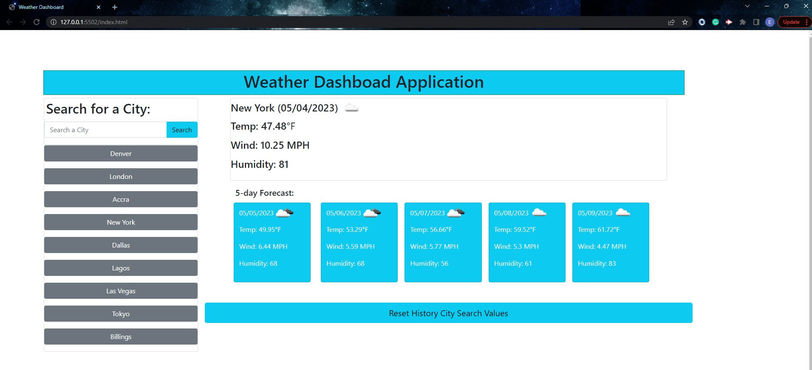

# weather-dashboard

## Daily and Five Day Weather Forecast
It is a daily and as well as a five day weather forecast application that allows users to search for any city in the world.
It allows users to plan their current day and week for their own city and other cities around the world to aid them in their travels.
A very comprehensive weather app that users can rely on to plan their day and week in their current city and around the world.

## Usage
The user is presented with a searh input field that they insert/type any city of their choosing and when they click on the search 
button the current weather with date, temperation, temperation symbol that dipicts the weather, wind, and humidity are displayed. 
In addition, the same information is presented in a 5 day weather forecast. The user can input as many city they want at a time and 
the city is stored as a button below the search button for future use. They can click on the stored city to get the current weather 
and the 5 day weather forecast. There is a reset button that allows the user to clear the stored cities and reset the values in the 
local storage.

## Technology Used
- HTML
- CSS
- JavaScript
- JQuery
- BootStrap

Below is the link to the deployed application

https://eugenestar5.github.io/weather-dashboard/